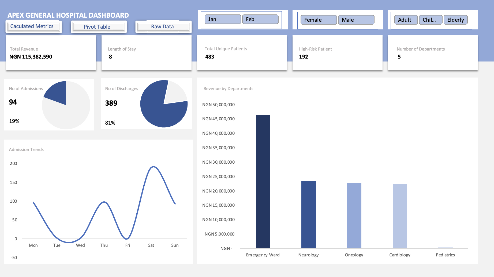

# Apex General Hospital Healthcare Data Analysis Dashboard

## Project Overview

This project presents an end-to-end healthcare data analysis workflow developed using Microsoft Excel.

The analysis covers the complete process from raw healthcare data to a fully interactive dashboard, including data cleaning, calculated metrics, exploratory analysis, pivot tables, data visualization, insights, and recommendations.

## Business Problem

Apex General Hospital needs to better understand its patient admissions, discharges, treatment costs, departmental performance, patient risk levels, and operational trends.

The goal of this analysis is to transform raw hospital data into meaningful insights that can support data-driven decision-making.

## Objectives

- Analyze patient admissions and discharges
- Evaluate revenue generated by each department
- Identify high-risk patients
- Analyze patient length of stay
- Compare departmental performance
- Identify admission trends
- Develop key performance indicators (KPIs)
- Create an interactive healthcare dashboard
- Provide actionable recommendations

## Tools Used

- Microsoft Excel
- Data Cleaning
- Excel Formulas
- Pivot Tables
- Data Visualization
- Dashboard Design
- Exploratory Data Analysis

## Project Workflow

1. Raw Data Collection
2. Data Cleaning
3. Calculated Metrics
4. Exploratory Analysis
5. Pivot Table Analysis
6. Dashboard Wireframing
7. Dashboard Development
8. Insights and Recommendations

## Key Performance Indicators

The dashboard provides insights into:

- Total Revenue
- Average Length of Stay
- Total Unique Patients
- Number of High-Risk Patients
- Number of Departments
- Patient Admissions
- Patient Discharges
- Revenue by Department
- Admission Trends

## Key Insights

- The Emergency Ward generated the highest revenue among the hospital departments.
- Saturday recorded the highest number of patient admissions.
- A significant number of patients were classified as high-risk and required continued monitoring.
- The analysis revealed differences in revenue generation and patient outcomes across hospital departments.
- The Oncology department showed a need for further investigation due to prolonged patient stays and low recovery outcomes within the analyzed data.

## Recommendations

- Hospital management should investigate the factors contributing to prolonged patient stays in the Oncology department.
- Additional support and resources should be considered for departments experiencing high patient volumes.
- High-risk patients should receive continuous monitoring and appropriate follow-up care.
- Management should use departmental revenue and patient performance trends to improve resource allocation.
- Further analysis should be conducted regularly to monitor changes in hospital performance.

## Dashboard Preview

The project includes an interactive Excel dashboard containing:

- KPI cards
- Department revenue analysis
- Admission trends
- Admission and discharge analysis
- Patient risk analysis
- Interactive filters for month, gender, and age group
- 

## Project File

The complete Excel workbook containing the raw data, cleaned data, calculated metrics, pivot tables, wireframe, dashboard, and analysis is available in this repository.
